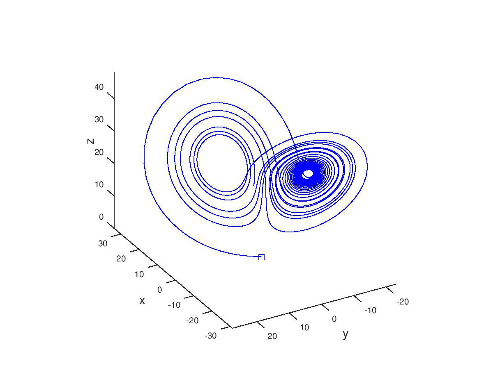
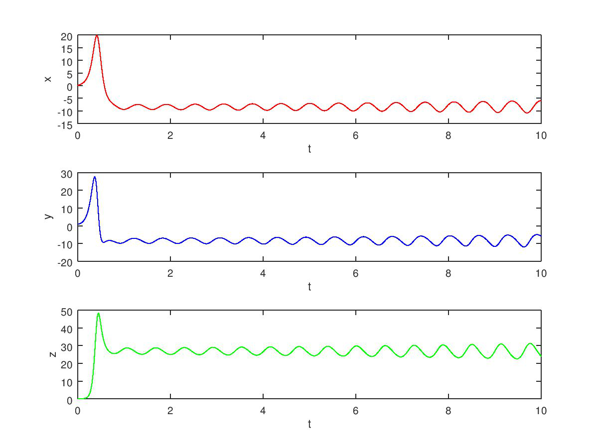
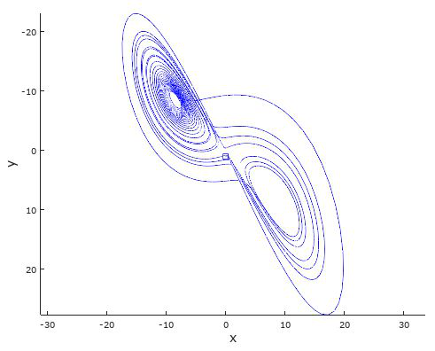
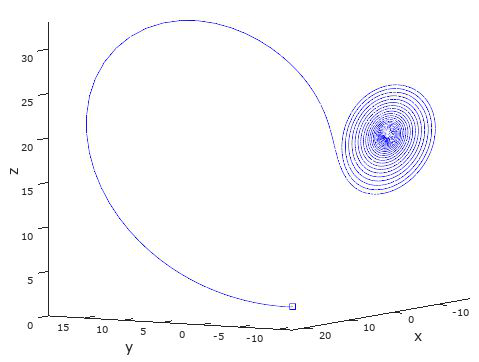
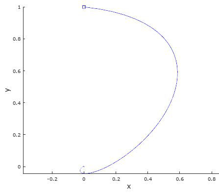

# Chaotic Orbitals & the Lorenz Equations

[](https://github.com/carter-hanford/chaotic-orbitals-2017)
[](https://github.com/carter-hanford/chaotic-orbitals-2017)
[](https://github.com/carter-hanford/chaotic-orbitals-2017)
[](https://www.mathworks.com/)
[](https://github.com/carter-hanford/chaotic-orbitals-2017)

Chaotic Orbitals is a group project for **MATH-3550 (Differential Equations)** at Saint Louis University. It reproduces the results of Edward Lorenz's 1963 paper *"Deterministic Nonperiodic Flow"* — the work that gave us the **butterfly effect** and helped launch modern chaos theory.

The project linearizes the Lorenz system, classifies its equilibrium points, and solves the system numerically in **MATLAB** with the **Improved Euler's Method**. It then pushes the model past Lorenz's original parameters to see how the system behaves in sub-critical, super-critical, and negative-`r` conditions.

The full write-up (with proofs and MATLAB code) is in [Chaotic Orbitals & the Lorenz Equations.pdf](Chaotic%20Orbitals%20%26%20the%20Lorenz%20Equations.pdf).



## **Notable Results**
- Reproduction of Lorenz's original 1963 plots (σ = 10, b = 8/3, r = 28)
- Linearization of the system with the Jacobian matrix
- Classification of all three equilibrium points (sink, saddle, spiral source)
- Derivation of the critical value r꜀ ≈ 24.74 where stability breaks down
- Parameter experiments: sub-critical, super-critical, and negative r

**The Model**

Lorenz simplified a nonlinear system that describes convective flow in a fluid layer with a constant temperature difference between its top and bottom:

```
dx/dt = σ(y − x)
dy/dt = −xz + rx − y
dz/dt = xy − bz
```

- **X(t)** — convective motion (transfer of heat)
- **Y(t)** — temperature difference between the two layers
- **Z(t)** — deviation from a linear temperature profile
- **σ, r, b** — constants; σ is the Prandtl number

Setting each derivative to zero gives three equilibria: the origin, plus two symmetric points that only exist for r ≥ 1. A bifurcation happens at r = 1, and the system loses all stability past r꜀ = σ(σ + b + 3)/(σ − b − 1) ≈ 24.74.

**Reproducing Lorenz's Results**

With σ = 10, b = 8/3, r = 28, and initial condition (X, Y, Z) = (0, 1, 0), the Improved Euler's Method reproduces the classic non-periodic behavior. The solution never settles and never repeats:



In the phase plane, the solution curve jumps between the two unstable equilibrium points — it moves toward one, gets too close, and swings out toward the other. This is the two-lobed "butterfly" shape the system is famous for:



**Sub-critical vs. Super-critical Behavior**

Lorenz's r = 28 is super-critical (r > r꜀), which is why the orbit is chaotic. Dropping to r = 20 makes the system sub-critical: both equilibrium points become spiral sinks, and the solution spirals cleanly into one of them instead of wandering forever:



**Negative r**

With r < 1 the origin is the only equilibrium point. At r = −5 (with σ = 10, b = 8/3) it becomes a spiral sink, and the solution curls straight into it:



---

## Running the Code

The appendix of the PDF contains the two complete MATLAB scripts:

- **Code 1 (`chaos2.m`)** — solves the system and draws the 3D attractor with `plot3`
- **Code 2** — solves the system and plots X, Y, and Z against time

Both use the Improved Euler's Method with a step size of `dt = 0.01`. To try your own experiments, change the parameter block at the top of either script:

```matlab
% values of the parameters
sig = 10.0; b = (8/3); r = 28;

% initial conditions
t0 = 0; x0 = 0; y0 = 1; z0 = 0;

% step size and time interval
dt = 0.01; tu = 20;
```

Some values to try:

- **r = 28** — chaos (the classic attractor)
- **r = 20** — sub-critical, spiral sink
- **σ = 10, b = 10** — satisfies σ < b + 1, converges fast
- **r = −5** — single spiral sink at the origin

---

## Authors

- Annika Hylen
- Carter Hanford
- Emily Borgemenke
- Sravya Ainapurapu

Saint Louis University — Fall 2017

## References

Lorenz, E. N. (1963). *Deterministic Nonperiodic Flow.* Journal of the Atmospheric Sciences, 20(2), 130–141.
